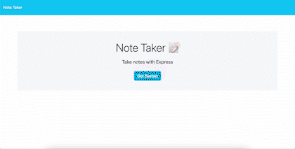

# Note Taker
  
  

  ## Table of Contents
  * [Description](#description)
  * [Installation](#installation)
  * [Usage](#usage)
  * [Contributing](#contributing)
  * [Tests](#tests)
  * [License](#license)
  * [Questions](#questions)

  ## Description
  The Note Taker is a useful tool for writing and saving notes. It makes use of Express.js on the back end and saves/retrieves data from a JSON file. This application is specifically designed for small business owners who want to organize their thoughts and keep track of tasks. Users can write notes, view those notes, and delete them. 

  ## Installation
  To install the Note Taker, download [the repository](https://github.com/mshaari/note-taker) from GitHub and open in Visual Studio Code. Run 'npm install' to install all dependencies. 

  The Note Taker is also accessible without having to install anything. Through Heroku, you can use the Note Taker simply by clicking [here](https://floating-scrubland-28964.herokuapp.com/notes). 

  ## Usage
  To invoke the Note Taker, open 'server.js' in an integrated terminal, run 'node server.js', and visit http://localhost:3001/ to run the Note Taker locally on your computer. 

  Here is a quick a tutorial of how to use the Note Taker: 
  
  

  ## Contributing
  Please do not contribute to this application.

  ## License
  This application has [no license](https://choosealicense.com/no-permission).

  ## Questions
  Please visit my GitHub profile by clicking on my username: [mshaari](https://github.com/mshaari). If you have additional questions, please email me at michael.shaari@gmail.com.